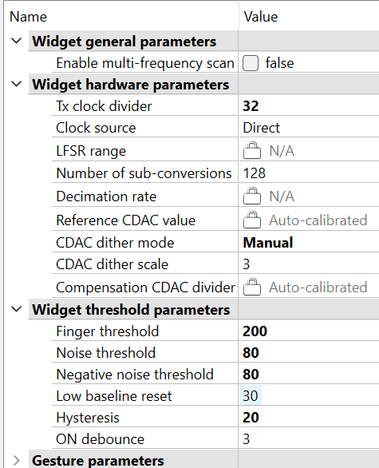

# PSoC&trade; 4: MSC CAPSENSE&trade; CSX button tuning

This code example demonstrates how to use the CAPSENSE&trade; middleware to detect a finger touch on a mutual-capacitance-based button widget in PSoC&trade; 4 devices with multi sense converter (MSC).

In addition, this code example also explains how to manually tune the mutual-capacitance-based button for optimum performance with respect to parameters such as reliability, power consumption, response time, and linearity using the CSX-RM sensing technique and CAPSENSE&trade; tuner GUI. Here,  CAPSENSE&trade; CSX represents the mutual-capacitance sensing technique and RM represents the ratiometric method.

## Requirements

- [ModusToolbox&trade; software](https://www.infineon.com/modustoolbox) v3.2 or later (tested with v3.2)

  **Note:** This code example version requires ModusToolbox&trade; software version 3.2 or later and is not backward compatible with v2.4 or older versions.

- Board support package (BSP) minimum required version: 3.0.0
- Programming language: C
- Associated parts: [PSoC&trade; 4100S Max](https://www.infineon.com/cms/en/product/microcontroller/32-bit-psoc-arm-cortex-microcontroller/psoc-4-32-bit-arm-cortex-m0-mcu/psoc-4100/)[ and PSoC&trade; 4 HV (High Voltage)](https://www.infineon.com/cms/en/product/microcontroller/32-bit-psoc-arm-cortex-microcontroller/32-bit-psoc-4-hv-arm-cortex-m0/)

## Supported toolchains (make variable 'TOOLCHAIN')

- GNU Arm&reg; embedded compiler v11.3.1 (`GCC_ARM`) - Default value of `TOOLCHAIN`
- Arm&reg; compiler v6.16 (`ARM`)
- IAR C/C++ compiler v9.30.1 (`IAR`)


## Supported kits (make variable 'TARGET')

- [PSoC&trade; 4100S Max Pioneer Kit](https://www.infineon.com/CY8CKIT-041S-MAX) (`CY8CKIT-041S-MAX`) - Default value of `TARGET`
- [PSoC&trade; 4 HVMS-128K Evaluation Kit](https://www.infineon.com/KIT_PSoC4-HVMS-128K_LITE) (`KIT_PSoC4-HVMS-128K_LITE`)
- [PSoC&trade; 4 HVMS-64K Evaluation Kit](https://www.infineon.com/KIT_PSoC4-HVMS-64K_LITE) (`KIT_PSoC4-HVMS-64K_LITE`)


## Hardware setup

This example uses the board's default configuration. See the kit user guide to ensure that the board is configured correctly.

**Note:** The PSoC&trade; 4 kits ship with KitProg2 installed. The ModusToolbox&trade; software requires KitProg3. Before using this code example, make sure that the board is upgraded to KitProg3. The tool and instructions are available in the [Firmware Loader](https://github.com/Infineon/Firmware-loader) GitHub repository. If you do not upgrade, you will see an error like "unable to find CMSIS-DAP device" or "KitProg firmware is out of date".


## Software setup

This example requires no additional software or tools.


## Using the code example

Create the project and open it using one of the following:

<details><summary><b>In Eclipse IDE for ModusToolbox&trade; software</b></summary>

1. Click the **New Application** link in the **Quick Panel** (or, use **File** > **New** > **ModusToolbox&trade; Application**). This launches the [Project Creator](https://www.infineon.com/ModusToolboxProjectCreator) tool.

2. Pick a kit supported by the code example from the list shown in the **Project Creator - Choose Board Support Package (BSP)** dialog.

   When you select a supported kit, the example is reconfigured automatically to work with the kit. To work with a different supported kit later, use the [Library Manager](https://www.infineon.com/ModusToolboxLibraryManager) to choose the BSP for the supported kit. You can use the Library Manager to select or update the BSP and firmware libraries used in this application. To access the Library Manager, click the link from the **Quick Panel**.

   You can also just start the application creation process again and select a different kit.

   If you want to use the application for a kit not listed here, you may need to update the source files. If the kit does not have the required resources, the application may not work.

3. In the **Project Creator - Select Application** dialog, choose the example by enabling the checkbox.

4. (Optional) Change the suggested **New Application Name**.

5. The **Application(s) Root Path** defaults to the Eclipse workspace which is usually the desired location for the application. If you want to store the application in a different location, you can change the *Application(s) Root Path* value. Applications that share libraries should be in the same root path.

6. Click **Create** to complete the application creation process.

For more details, see the [Eclipse IDE for ModusToolbox&trade; software user guide](https://www.infineon.com/MTBEclipseIDEUserGuide) (locally available at *{ModusToolbox&trade; software install directory}/docs_{version}/mt_ide_user_guide.pdf*).

</details>

<details><summary><b>In command-line interface (CLI)</b></summary>

ModusToolbox&trade; software provides the Project Creator as both a GUI tool and the command line tool, "project-creator-cli". The CLI tool can be used to create applications from a CLI terminal or from within batch files or shell scripts. This tool is available in the *{ModusToolbox&trade; software install directory}/tools_{version}/project-creator/* directory.

Use a CLI terminal to invoke the "project-creator-cli" tool. On Windows, use the command line "modus-shell" program provided in the ModusToolbox&trade; software installation instead of a standard Windows command-line application. This shell provides access to all ModusToolbox&trade; software tools. You can access it by typing `modus-shell` in the search box in the Windows menu. In Linux and macOS, you can use any terminal application.

The "project-creator-cli" tool has the following arguments:

Argument | Description | Required/optional
---------|-------------|-----------
`--board-id` | Defined in the `<id>` field of the [BSP](https://github.com/Infineon?q=bsp-manifest&type=&language=&sort=) manifest | Required
`--app-id`   | Defined in the `<id>` field of the [CE](https://github.com/Infineon?q=ce-manifest&type=&language=&sort=) manifest | Required
`--target-dir`| Specify the directory in which the application is to be created if you prefer not to use the default current working directory | Optional
`--user-app-name`| Specify the name of the application if you prefer to have a name other than the example's default name | Optional

<br />

The following example clones the "[CSX button tuning](https://github.com/Infineon/mtb-example-psoc4-msc-capsense-csx-button-tuning)" application with the desired name "CsxButtonTuning" configured for the *KIT_PSoC4-HVMS-64K_LITE* BSP into the specified working directory, *C:/mtb_projects*:

   ```
   project-creator-cli --board-id KIT_PSoC4-HVMS-64K_LITE --app-id mtb-example-psoc4-msc-capsense-csx-button-tuning --user-app-name CsxButtonTuning --target-dir "C:/mtb_projects"
   ```

**Note:** The project-creator-cli tool uses the `git clone` and `make getlibs` commands to fetch the repository and import the required libraries. For details, see the "Project creator tools" section of the [ModusToolbox&trade; software user guide](https://www.infineon.com/ModusToolboxUserGuide) (locally available at *{ModusToolbox&trade; software install directory}/docs_{version}/mtb_user_guide.pdf*).

To work with a different supported kit later, use the [Library Manager](https://www.infineon.com/ModusToolboxLibraryManager) to choose the BSP for the supported kit. You can invoke the Library Manager GUI tool from the terminal using `make library-manager` command or use the Library Manager CLI tool "library-manager-cli" to change the BSP.

The "library-manager-cli" tool has the following arguments:

Argument | Description | Required/optional
---------|-------------|-----------
`--add-bsp-name` | Name of the BSP that should be added to the application | Required
`--set-active-bsp` | Name of the BSP that should be as active BSP for the application | Required
`--add-bsp-version`| Specify the version of the BSP that should be added to the application if you do not wish to use the latest from manifest | Optional
`--add-bsp-location`| Specify the location of the BSP (local/shared) if you prefer to add the BSP in a shared path | Optional

<br />

Following example adds the KIT_PSoC4-HVMS-64K_LITE BSP to the already created application and makes it the active BSP for the app:

   ```
   ~/ModusToolbox/tools_{version}/library-manager/library-manager-cli --project "C:/mtb_projects/MSCCSXButtonTuning" --add-bsp-name KIT_PSoC4-HVMS-64K_LITE --add-bsp-version "latest-v4.X" --add-bsp-location "local"

   ~/ModusToolbox/tools_{version}/library-manager/library-manager-cli --project "C:/mtb_projects/MSCCSXButtonTuning" --set-active-bsp APP_KIT_PSoC4-HVMS-64K_LITE
   ```

</details>

<details><summary><b>In third-party IDEs</b></summary>

Use one of the following options:

- **Use the standalone [Project Creator](https://www.infineon.com/ModusToolboxProjectCreator) tool:**

   1. Launch Project Creator from the Windows Start menu or from *{ModusToolbox&trade; software install directory}/tools_{version}/project-creator/project-creator.exe*.

   2. In the initial **Choose Board Support Package** screen, select the BSP, and click **Next**.

   3. In the **Select Application** screen, select the appropriate IDE from the **Target IDE** drop-down menu.

   4. Click **Create** and follow the instructions printed in the bottom pane to import or open the exported project in the respective IDE.

<br />

- **Use command-line interface (CLI):**

   1. Follow the instructions from the **In command-line interface (CLI)** section to create the application.

   2. Export the application to a supported IDE using the `make <ide>` command.

   3. Follow the instructions displayed in the terminal to create or import the application as an IDE project.

For a list of supported IDEs and more details, see the "Exporting to IDEs" section of the [ModusToolbox&trade; software user guide](https://www.infineon.com/ModusToolboxUserGuide) (locally available at *{ModusToolbox&trade; software install directory}/docs_{version}/mtb_user_guide.pdf*).

</details>


## Operation

1. Connect the board to your PC using the provided micro USB cable through the KitProg3 USB connector on J8 as shown in **Figure 1**:

   **Figure 1. Connecting the KIT_PSoC4-HVMS-64K_LITE to a computer**

   

2. Program the board using one of the following:

   <details><summary><b>Using Eclipse IDE for ModusToolbox&trade; software</b></summary>

      1. Select the application project in the Project Explorer.

      2. In the **Quick Panel**, scroll down, and click **\<Application Name> Program (KitProg3_MiniProg4)**.
   </details>

   <details><summary><b>Using CLI</b></summary>

     From the terminal, execute the `make program` command to build and program the application using the default toolchain to the default target. The default toolchain is specified in the application's Makefile but you can override this value manually:
      ```
      make program TOOLCHAIN=<toolchain>
      ```

      Example:
      ```
      make program TOOLCHAIN=GCC_ARM
      ```
   </details>

3. After programming, the application starts automatically.

4. To test the application, place your finger over the CAPSENSE&trade; button and notice that the user LED turns ON when touched and turns OFF when the finger is lifted.

5. You can also monitor the CAPSENSE&trade; data using the CAPSENSE&trade; tuner application as follows:

### Monitor data using the CAPSENSE&trade; tuner

1. Open the CAPSENSE&trade; tuner from the **Tools** section in the IDE Quick Panel.

   You can also run the CAPSENSE&trade; tuner application standalone from *{ModusToolbox&trade; software install directory}/ModusToolbox/tools_{version}/capsense-configurator/capsense-tuner*. In this case, after opening the application; select **File** > **Open** and open the *design.cycapsense* file of the respective application, which is in the *{Application root directory}/bsps/TARGET_\<BSP-NAME>/config* folder.

   See the [ModusToolbox&trade; software user guide](https://www.infineon.com/ModusToolboxUserGuide) (locally available at *{ModusToolbox&trade; software install directory}/docs_{version}/mtb_user_guide.pdf*) for options to open the CAPSENSE&trade; tuner application using the CLI.

2. Ensure that the kit is in CMSIS-DAP bulk mode (KitProg3 status LED is ON and not blinking). See [Firmware-loader](https://github.com/Infineon/Firmware-loader) to learn how to update the firmware and switch modes in KitProg3.

    3. In the tuner application, click on the **Tuner Communication Setup** icon or select **Tools** > **Tuner Communication Setup**. In the window that appears, select the UART checkbox under KitProg3 and configure as follows:

       - **Baud-rate:** 115200

        These are the same values set in the UART resource.

   **Figure 2. Tuner communication setup parameters**

   

    4. Click **Connect** or select **Communication** > **Connect** to establish a connection.

   **Figure 3. Tuner Communication Setup parameters**

   

    5. Click **Start** or select **Communication** > **Start** to start data streaming from the device.

   **Figure 4. Start tuner communication**

   

         The *Widget/Sensor parameters* tab gets updated with the parameters configured in the *CAPSENSE&trade; configurator* window. The tuner displays the data from the sensor in the **Widget View** and **Graph View** tabs.

    6.  Set the **Read Mode** to Synchronized mode. Navigate to the  **Widget View** tab, you can see the **Button0** widget highlighted in blue color when you touch it.

   **Figure 5. Widget view of the CAPSENSE&trade; tuner**

   

    7. You can view the raw count, baseline, difference count and status for each sensor in the **Graph View** tab. For example, to view the sensor data for Button 1, select **Button1_Rx0** under **Button1**.

   **Figure 6. Graph view of the CAPSENSE&trade; tuner**

   

    8. Observe the **Widget/Sensor Parameters** section in the CAPSENSE&trade; tuner window as shown in **Figure 6**.
      
   9. Switch to the **SNR Measurement** tab for measuring the SNR and verify that the SNR is above 5:1, select **Button1** and **Button1_Rx0** sensor, and then click **Acquire Noise** as shown in **Figure 7**.

   **Figure 7. CAPSENSE&trade; tuner - SNR measurement: Acquire Noise**

   

   10. Once the noise is acquired, place the metal finger at a position on the button and then click **Acquire Signal**. Ensure that the metal finger remains on the button as long as the signal acquisition is in progress. Observe the SNR is above 5:1.

         The calculated SNR on this button is displayed, as shown in **Figure 8**. Based on your end system design, test the signal with a finger that matches the size of your normal use case. Typically, finger size targets are ~8 to 9 mm. Consider testing with smaller sizes that should be rejected by the system to ensure that they do not reach the finger threshold.

   **Figure 8. CAPSENSE&trade; tuner - SNR measurement: Acquire Signal**

   

</details>

<br>

## Tuning procedure

<details><summary><b> Create a custom BSP for your board </b></summary>

1. Create a custom BSP for your board having any device, by following the steps given in [KBA231373](https://community.infineon.com/t5/Knowledge-Base-Articles/ModusToolbox-2-2-and-later-Make-a-Custom-BSP-KBA231373/ta-p/251107). In this code example, it was created for the device "CY8C4149AZI-S598".

2. Open the *design.modus* file from *{Application root directory}/bsps/TARGET_\<BSP-NAME>/config* folder obtained in the previous step and enable CAPSENSE&trade; to get the *design.cycapsense* file. CAPSENSE&trade; configuration can then be started from scratch as explained below.

</details>

The following steps explain the tuning procedure: 

**Note:** See the section "Selecting CAPSENSE&trade; hardware parameters" in the [PSoC&trade; 4 and PSoC&trade; 6 MCU CAPSENSE&trade; design guide](https://www.infineon.com/AN85951) to learn about the considerations for selecting each parameter value.

**Figure 9. CSX button widget tuning flow**  


Do the following to tune the button widget:

<details><summary><b>Stage 1. Set the initial hardware parameters</b></summary>

1. Connect the board to your PC using the provided USB cable through the KitProg3 USB connector.

2. Launch the Device configurator tool.
   
   You can launch the Device configurator in the Eclipse IDE for ModusToolbox&trade; software from the **Tools** section in the IDE Quick Panel.

   You can also launch it in stand-alone mode from *{ModusToolbox&trade; software install directory}/ModusToolbox/tools_{version}/device-configurator/device-configurator*. In this case, after opening the application, select **File** > **Open** and open the *design.modus* file of the respective application, which is in the *{Application root directory}/bsps/TARGET_\<BSP-NAME>/config* folder.

      **Note**: If you are using the custom BSP with the Empty PSoC&trade; 4 starter application, use *{Application root directory}/bsps/TARGET_\<BSP-NAME>/config* folder to open the *design.modus* file.

3. In the [KIT_PSoC4-HVMS-64K_LITE](https://www.infineon.com/KIT_PSoC4-HVMS-64K_LITE), the button pins are connected to channel 0. Hence, make sure to enable channel 0 in the Device Configurator as shown in **Figure 10**.

   **Figure 10. Enable MSC channel in Device Configurator**

   

      Save the changes and close the window.

4. Launch the CAPSENSE&trade; configurator tool.
   
   You can launch it in stand-alone mode from *{ModusToolbox&trade; software install directory}/ModusToolbox/tools_{version}/capsense-configurator/capsense-configurator*. In this case, after opening the application, select **File** > **Open** and open the *design.cycapsense* file of the respective application, which is in the *{Application root directory}/bsps/TARGET_\<BSP-NAME>/config* folder.

   **Note**: If you are using the custom BSP with the Empty PSoC&trade; 4 starter application, use *{Application root directory}/bsps/TARGET_\<BSP-NAME>/config* folder to open the *design.cycapsense* file.

   See the [ModusToolbox&trade; software CAPSENSE&trade; configurator tool guide](https://www.infineon.com/ModusToolboxCapSenseConfig) for step-by-step instructions on how to configure and launch CAPSENSE&trade; in ModusToolbox&trade;. 

5. In the **Basic** tab, note that two button widgets 'Button0' and 'Button1' configured as a CSX-RM (Mutual-cap).

   **Figure 11. CAPSENSE&trade; configurator - Basic tab**

   


6. Do the following in the **General** tab under the **Advanced** tab:

   - Set **Scan mode** as **INTR driven**.
   - Set **Sensor connection method** as **AMUXBUS**.

     Use AMUXBUS if your design has few number of sensors or if the sensors are connected to AMUXBUS pins.

        **Note:** For sensors using **CSX-RM** sensing mode with **CTRLMUX** as sensor connection method refer to the [Touchpad code example](https://github.com/Infineon/mtb-example-psoc4-msc-capsense-csx-touchpad-tuning).

   - **Modulator clock divider** is set to **1** to obtain the maximum available modulator clock frequency as recommended in the [CAPSENSE&trade; design guide](https://www.infineon.com/AN85951). 

      **Note:** The modulator clock frequency can be set to 48,000 kHz only after changing the IMO clock frequency to 48 MHz, since the modulator clock is derived from the IMO clock. Do the following:

       1. Under the **System** tab in the **Device Configurator** tool, select **System Clocks** > **Input** > **IMO**. 
    
       2. Select **48** from the **Frequency(MHz)** drop-down list.
   
   - **Number of init sub-conversions** is set based on the hint shown when you hover over the edit box. Retain the default value (will be set in **Stage 3**) 

   - Check the **Enable self-test library** selection. This is required for sensor capacitance measurement using BIST.
   
   - Retain the default settings for all the filters. You can enable the filters later depending on the signal-to-noise ratio (SNR) requirements in **Stage 4**.
     
    The filters are used to reduce the peak-to-peak noise. Using the filters will result in higher scan time.

   **Figure 12. CAPSENSE&trade; configurator - General settings**

   

      **Note:** Each tab has a button **Restore Defaults** to restore the parameters of that tab to their default values.


7. Go to the **CSX Settings** tab and make the following changes:

   - Set **Inactive sensor connection** as **Ground**.

   - Set **Number of reported fingers** as **2** for two-finger detection.

   - Select **Enable CDAC auto-calibration** and **Enable compensation CDAC**.

     This helps in achieving the required CDAC calibration levels (40% of maximum count) for all the sensors in the widget while maintaining the same sensitivity across the sensor elements.

   **Figure 13. CAPSENSE&trade; configurator - Advanced CSX settings**

   


8. Go to the **Widget Details** tab. Select **Button0** and **Button1** from the left pane, and then set the following:

   - **Tx clock divider:** Retain default value (will be set in **Stage 3**)

   - **Clock source:** **Direct**

      **Note:** Spread spectrum clock (SSC) or PRS clock can be used as a clock source to deal with EMI/EMC issues.

   - **Number of sub-conversions: 128**

     100 is a good starting point to ensure a fast scan time and sufficient signal. This value will be adjusted as required in **Stage 4**.

   - Select **CDAC dither mode: Manual** 

   - **Finger Threshold: 200**

   - **Noise Threshold: 80**

   - **Negative Noise Threshold: 80** 

   - **Hysteresis: 20**

     These values reduces the influence of baseline on the sensor signal, which helps to get the true difference-count. Retain the default values for all other threshold parameters; these parameters are set in **Stage 5**.

   **Figure 14. CAPSENSE&trade; configurator - Widget details tab under the Advanced tab**  
      
   

9. Go to the **Scan Configuration** tab to select the pins and scan slots. Do the following:

   - Configure channel for the button electrodes using the drop-down menu.

     As seen in **Figure 15**, the button needs to be equally distributed between channel 0.

   - Configure pins for the electrodes using the drop-down menu.

   - Configure the scan slots using **Auto-assign slots** option or each sensor is allotted a scan slot based on the entered slot number. 

      The summary section in the **Scan Configuration** tab is an indication of the distribution of scan of the sensor in each slot. Each slot allows simultaneous scanning of channel 0 if the Tx clock divider and the number of sub conversions are same.  The basic recommendation for slot selection is to enter the slot number applicable which might help in achieving less scan time by parallel scanning.

      In CSX-RM sensing method, the Rx pin is scanned for each button. In the [KIT_PSoC4-HVMS-64K_LITE](https://www.infineon.com/KIT_PSoC4-HVMS-64K_LITE), the Rx pin in Channel 0 is shared between Button 0 and Button 1. Therefore, the summary section in the *Scan Configuration* tab shows that the Channel 0 is highlighted in Slot 0, and Slot 1 shows that Channel 0 is scanned.

      **Note** See [AN85951 – PSoC&trade; 4 and PSoC&trade; 6 MCU CAPSENSE&trade; design guide](https://www.infineon.com/AN85951) for more details on Scan slot allotment rules.

   - Check the notice list for warning or errors.

   **Figure 15. Scan Configuration tab**

   

10. Click **Save** to apply the settings.


</details>

<details><summary><b> Stage 2: Measure the parasitic capacitance (Cp) </b></summary>

Use one of the following options to determine the Cp of the sensor:

   - [Option 1: Using BIST API in CAPSENSE&trade; middleware]

   - [Option 2: Using LCR meter]
   
   **Option 1: Using BIST API in CAPSENSE&trade; middleware**

   While using this procedure, ensure that you have enabled the **Enable self-test library** option in the CAPSENSE&trade; configurator. After you obtained the Cp value, you can disable this option.

   1. Estimate the Cp of the Tx and Rx electrode using the `Cy_CapSense_MeasureCapacitanceSensorElectrode()` function in firmware. The measured capacitance value is in femtofarad (fF).
   
   2. Program the board in Debug mode.

      In the IDE, use the **\<Application Name> Debug (KitProg3)** configuration in the **Quick Panel**.

      For more details, see the "Program and Debug" section in the Eclipse IDE for ModusToolbox&trade; software user guide: *{ModusToolbox&trade; install directory}/docs_{version}/mt_ide_user_guide.pdf*.

   3. Place a breakpoint after the capacitance measurement.

   4. In the **Expressions** window, add the Cp measurement variables (**tx0_cp**, **tx0_cp_staus**, **rx0_cp**, **rx0_cp_status** **tx1_cp**, **tx1_cp_staus**, **rx1_cp**, **rx1_cp_status**).

      The status of the measurement can also be read through the return value of the function in the **Expressions** window.

   5. Click the **Resume** button (green arrow) to reach the breakpoint.

      Note that the function return value reads `CY_CAPSENSE_BIST_SUCCESS_E` and the measurement variables provide the capacitance value of the sensor elements in **femtofarad** as shown in **Figure 5**.

   6. Click the **Terminate** button (red box) to exit Debug mode.

      **Figure 16. Cp measurement using BIST**

      


   **Option 2: Using LCR meter**

   Measure the Cp of the sensor electrode of the button using an LCR meter. The Cp should be measured between the sensor electrode (sensor pin) and the device ground.

</details>

<details><summary><b>Stage 3: Calculate and set the Tx clock frequency and Init sub-conversions</b></summary>

1. Calculate maximum Tx clock frequencies using **Equation 1**


   **Equation 1. Maximum Tx clock frequency**

   

   Where, C<sub>P_Tx</sub> and C<sub>P_Rx</sub> are the parasitic capacitances of the Tx and Rx electrodes respectively. This value is obtained from **Stage 2**.

   R<sub>Series_Cp_Tx</sub> and R<sub>Series_Cp_Rx</sub> is the total series resistance of the Tx and Rx electrodes respectively, which includes the 525-ohm pin internal resistance, external series resistance (in CY8CKIT-041S-MAX, it is 2 kilo-ohm), and the trace resistance. Include the trace resistance if high-resistive material such as ITO, or conductive ink is used. The external resistor is connected between the sensor Tx/Rx electrode pad and the device pin to reduce the radiated emission. ESD protection is built into the device.

2. The Tx clock divider value, as given by **Equation 2**, is obtained by dividing HFCLK (48 MHz) by **Maximum Tx clock frequency (kHz)** calculated and choosing the nearest ceiling Tx clock divider option in the Configurator.
      
   **Equation 2. Tx clock divider**

   

   **Table 3. Tx clock divider settings in configurator**

   |Development kit | Tx Cp (pF)|  Rx Cp (pF)| R<sub>SeriesTx/Rx</sub> (ohm) |  Maximum Tx clock frequency (kHz)| Tx clock divider setting in configurator|
   | --- | --- | --- | --- | --- |--- |
   |KIT_PSoC4-HVMS-64K_LITE (Tx-P4.4, Rx-P4.6) | 24 |23  | 2.525k | 1650| 30|
   |KIT_PSoC4-HVMS-64K_LITE (Tx-P4.5, Rx-P4.7) | 28 | 23 | 2.525k | 1414 | 34|

   **Note** 
   - If you are explicitly using the PRS or SSCx clock source to lower electromagnetic interference, ensure that you select the Tx clock frequency that meets the conditions mentioned in the [ModusToolbox&trade; software CAPSENSE&trade; configurator guide](https://www.infineon.com/ModusToolboxCapSenseConfig) in addition to the above conditions. PRS and SSCx techniques spread the frequency across a range.

   - Actual Tx clock frequency value is choosen such that the divider is divisible by 2, in order to have all the 2 scan phases for equal durations. 

      **Table 3. Tx clock frequency settings for KIT_PSoC4-HVMS-64K_LITE kit**

      |Development kit | Tx clock divider | 
      | --- | ---  |
      |KIT_PSoC4-HVMS-64K_LITE (Tx-P4.4, Rx-P4.6) |  30 |
      |KIT_PSoC4-HVMS-64K_LITE (Tx-P4.5, Rx-P4.7) |  34 |


3. The maximum frequency set should charge and discharge the sensor completely, which you can verify using an oscilloscope and an active probe. To view the charging and discharging waveforms of the sensor, probe at the sensors Tx electrode (or as close as possible to the sensors), and not at the pins or resistor. An example of proper and improper charging of the sensor Tx electrode is shown in **Figure 17** and **Figure 18** respectively. You can also use a passive probe which will add an additional parasitic capacitance of around 15pF and thus the tuning may be not optimal.
   
   **Figure 17. Proper charge cycle of a sensor Tx electrode**

   

   **Figure 18. Improper charge cycle of a sensor Tx electrode**

   

   Set the calculated value in the CAPSENSE&trade; configurator using the steps given in **Step 8** in **Stage 1**, which ensures the maximum possible Tx clock frequency (for good gain) while allowing the sensor capacitance to fully charge and discharge in each phase of the MSC CSX sensing method.

4. Program the board.

5. Fine-tune the Tx clock frequency.

   1. Check the calibration pass/fail status from the return value of the function `Cy_CapSense_Enable()`. 

   2. Launch the CAPSENSE&trade; tuner to monitor the CAPSENSE&trade; data and for CAPSENSE&trade; parameter tuning.
   
   See the [CAPSENSE&trade; tuner guide](https://www.infineon.com/ModusToolboxCapSenseTuner) for step-by-step instructions on how to launch and configure the CAPSENSE&trade; tuner in ModusToolbox&trade; software.

   3. Ensure that the following condition is satisfied for the selected Tx clock frequency:

      - The auto-calibrated reference CDAC value should be within the range (10/Compensation CDAC Divider) to 255 and Compensation CDAC values are in the range 1 to 255. Verify this once the initial hardware parameters are loaded into the device.

         **Note:** If the reference CDAC value is equal to 1, ensure that the Compensation CDAC value is greater than or equal to 98.

      - Click **Button0** in the **Widget Explorer** to view the Reference CDAC value in the Sensor Parameters window.
      - Also, click each sensor element, for example, **Button0_Rx0** in the **Widget Explorer** to view the Compensation CDAC in the Sensor Parameters window.

      Refer to the [CAPSENSE&trade; design guide](https://www.infineon.com/AN85951) for the recommended guidelines on valid CDAC range (with and without compenation) to result in calibration PASS across multiple boards due to board-to-board variations.

   **Figure 19. Widget Explorer - button 0**

   

   **Figure 20. Widget Explorer - button 1**

   

   4. If the above condition is not satisfied, fine-tune the sense Tx clock divider to bring the CDAC value within range.

      1. If the Reference CDAC value is not in the recommended range increase or decrease the Tx clock divider in the Widget hardware parameters window.

         **Note** From the raw count equation ( see [AN85951 – PSoC&trade; 4 and PSoC&trade; 6 MCU CAPSENSE&trade; design guide](https://www.infineon.com/AN85951)), it is evident that increasing the Tx clock divider will decrease the reference CDAC value for a given calibration percent and vice versa.

      2. Click **To device** to apply the changes to the device as shown in **Figure 21**.

   **Figure 21. Apply changes to device**

   
         
      3. Click each sensor element, for instance, **Button0** in the Widget explorer.

      4. Observe the Reference CDAC value in the **Sensing parameters** section of the Widget Parameters window.

      5. Repeat steps 1 to 4 until you obtain Reference CDAC and Compensation CDAC in the recommended range.

   5. If the CDAC value is still not in the required range based on fine tuning the Tx clock divider then consider reducing the Modulator Clock Frequency to 24 MHz. The Tx clock frequency is dervied from Modulator clock frequency. Thus the corresponding Tx clock divider values needs to be updated.

   6. Actual Tx clock frequency value is choosen such that the divider is divisible by 2, in order to have all the 2 scan phases for equal durations.

   **Note:** 
   As **Figure 19** and **Figure 20** shows, CDAC values are in the recommended range. You can leave the Tx clock divider to the value as shown in **Step 2** of **Stage 3**.

   7. Capture the raw counts of each sensor  (as shown in **Figure 22**) and verify that they are approximately (+/- 5%) equal to 40% of the MaxCount. See [AN85951 – PSoC&trade; 4 and PSoC&trade; 6 MCU CAPSENSE&trade; design guide](https://www.infineon.com/an85951) for the MaxCount equation.

      **Note:** Calibration may fail if the obtained rawcounts is not within the targetted range. 

   **Figure 22. Verifying raw count calibration level**

   

6. Calculate and set the **Number of init sub-conversions** using **Equation 3**. 

   **Note**: **Equation 3** is considering the default values of Cmod = 2.2nF, Base % = 0.5 (50%), Auto-calibration % = 0.85 (85%). If you intend to change any value, refer to the [AN85951 – PSoC&trade; 4 and PSoC&trade; 6 MCU CAPSENSE&trade; design guide](https://www.infineon.com/an85951) to calculate the required number of init sub-conversions.

   **Equation 3: Number of init sub-conversions** 

   

   where,

      VDDA = 5 V

      Tx Clock Divider - Calculated in previous steps.

      Cref<sub>code</sub> - Reference CDAC code obtained from previous steps after fine tuning Tx clock divider. If there are multiple CSX widgets, select the code with least value.

   Here, Tx Clock Divider = 30, Reference CDAC = 4, VDDA = 5V. From **Equation 3**, Number of init-sub conversions = 4. 

   Set this value in the CAPSENSE&trade; configurator. Then, re-program and open the tuner.

</details>

<details> <summary><b>Stage 4: Use CAPSENSE&trade; tuner to fine-tune for required SNR and refresh rate</b> </summary>

1. Update the number of sub-conversions.

   Do the following to update the number of sub-conversions:

   1. Update the number of sub-conversions (N<sub>sub</sub>) directly in the **Widget/Sensor parameters** tab of the CAPSENSE&trade; tuner.

   2. Increase or decrease the number of sub-conversions by 10 and load the parameters to the device. The signal level is directly proportional to number of sub-conversion. 

2. Measure SNR as mentioned in the [Operation](#operation) section. And tune until the minimum SNR of 5:1, and a signal count greater than 50 are achieved.

3. Skip this step if the following conditions are met:

      - Measured SNR from the previous stage is greater than 5:1.
      - Signal count > 50.

   If your system is very noisy (counts >20), do the following to set enable fitlers: 

   1. Open **CAPSENSE&trade; configurator** from ModusToolbox&trade; software quick panel and select the appropriate filter:

   **Figure 23. Filter settings in CAPSENSE&trade; configurator**

   

      **Note:**
      - Add the filter based on the type of noise in your measurements. See [ModusToolbox&trade; software CAPSENSE&trade; configurator guide](https://www.infineon.com/ModusToolboxCapSenseConfig) for details.
      - The current example has SNR around 10:1; therefore, filters are not enabled.

   2. Reprogram the device to update filter settings.

   **Note:** 

   - Total scan time is equal to the sum of initialization time and the scan time given by **Equation 4**.

   **Equation 4. Scan time**

   
   
   - Refresh rate is the reciprocal of sum of total scan time and procesing time.

If the Refresh rate meets your requirements, go to next step otherwise fine tune the number of sub conversions.

</details>

<details><summary><b> Stage 5: Use CAPSENSE&trade; tuner to tune threshold parameters </b></summary>

The software threshold is set for each widget based on the diff counts. Steps for setting the threshold for one of the widget is given below. 

1. Switch to the **Graph View** tab and select **Button1**.

2. Touch the sensor and monitor the touch signal in the **Sensor Signal** graph as **Figure 25** shows. Place the metal finger at all possible positions and use the least signal for setting the software threshold. Also ensure to ground the metal finger.

   **Figure 25. Sensor signal when the sensor is touched**

   

3. When the signal is measured, set the thresholds according to the following recommendations:

   - Finger threshold = 80 percent of signal

   - Noise threshold = 40 percent of signal

   - Negative noise threshold = 40 percent of signal

   - Hysteresis = 10 percent of signal

   - Debounce = 3

4. Set the threshold parameters in the **Widget/Sensor parameters** section of the CAPSENSE&trade; tuner.

   **Figure 26. Widget threshold parameters**

   

5. Apply the settings to the device and to the project by clicking **To device** and then **To Project** as **Figure 27** shows, and close the tuner. The change is updated in the *design.cycapsense* file and reflected in the CAPSENSE&trade; configurator.

   **Figure 27. Apply to project setting**

   

6. Consider testing with metal finger with smaller sizes that should be rejected by the system to ensure that they do not reach the finger threshold. If your sensor is tuned correctly, you will observe the touch status go from 0 to 1 in the **Status** sub-window of the **Graph View** window as **Figure 28** shows. The successful tuning of the button is also indicated by the LED in the pioneer kit; the LED is turned ON when the finger touches the button and turned OFF when the finger is removed.

   **Figure 28. Sensor status in CAPSENSE&trade; tuner**

   

7. Close the CAPSENSE&trade; tuner and launch **CAPSENSE&trade; configurator**. You should now see all the changes that you made in the CAPSENSE&trade; tuner reflected in the **CAPSENSE&trade; configurator**.


   **Table 4. Software tuning parameters obtained based on sense for KIT_PSoC4-HVMS-64K_LITE** 
  
   |Parameter|	 Button 0 | Button 1 |
   |:--------|:------|:------|
   |Signal	| 60	| 60 |
   |Finger threshold 	| 48| 48 |
   |Noise threshold |24| 24|
   |Negative noise threshold	|24 | 24 |
   |Hysteresis	| 6 | 6|
   |ON debounce	|3| 3|
   |Low baseline reset	| 30| 30|


</details>

<br>

## Debugging

You can debug the example to step through the code. In the IDE, use the **\<Application Name> Debug (KitProg3_MiniProg4)** configuration in the **Quick Panel**. For details, see the "Program and debug" section in the [Eclipse IDE for ModusToolbox&trade; software user guide](https://www.infineon.com/MTBEclipseIDEUserGuide).


## Design and implementation

The project contains two button widgets configured in CSX-RM sensing mode. See the [Tuning procedure](#tuning-procedure) section for step-by-step instructions to configure the other settings of the **CAPSENSE&trade; configurator**.

The project uses the [CAPSENSE&trade; middleware](https://github.com/Infineon/capsense) (see ModusToolbox&trade; software user guide for more details on selecting a middleware). See [AN85951 – PSoC&trade; 4 and PSoC&trade; 6 MCU CAPSENSE&trade; design guide](https://www.infineon.com/AN85951) for more details on CAPSENSE&trade; features and usage.

The [ModusToolbox&trade;](https://www.infineon.com/ModusToolbox) provides a GUI-based tuner application for debugging and tuning the CAPSENSE&trade; system. The *CAPSENSE&trade; tuner* application works with EZI2C and UART communication interfaces. This project has an SCB block configured in EZI2C mode to establish communication with the on-board KitProg, which in turn enables reading the CAPSENSE&trade; raw data by the CAPSENSE&trade; tuner. See [EZI2C - Peripheral settings](#resources-and-settings).

The CAPSENSE&trade; data structure that contains the CAPSENSE&trade; raw data is exposed to the CAPSENSE&trade; tuner by setting up the I2C communication data buffer with the CAPSENSE&trade; data structure. This enables the tuner to access the CAPSENSE&trade; raw data for tuning and debugging CAPSENSE&trade;.

The successful tuning of the button is indicated by an LED in the pioneer kit; the LED is turned ON when the finger touches the button and turned OFF when the finger is removed from the button.

### Steps to setup the VDDA supply voltage in Device configurator

1. Open Device configurator from the Quick panel. 

2. Go to the **System** tab. Select the **Power** resource, and set the set the VDDA value under **Operating conditions** as shown in **Figure 29**. 

   **Figure 29. Setting the VDDA supply in System tab of device configurator**

    

**Note**: [PSoC&trade; 4100S Max pioneer kit](https://www.infineon.com/CY8CKIT-041S-MAX) has two onboard regulators 3.3V and 5V. To use 3.3V, place the jumper J10 at positions 2 and 3. See the Kit user guide for more details.


### Resources and settings

**Figure 30. UART settings**


**Table 3. Application resources**

| Resource  |  Alias/object     |    Purpose     |
| :-------  | :------------     | :------------  |
| SCB (UART) (PDL) | CYBSP_UART          | EZI2C slave driver to communicate with CAPSENSE&trade; tuner |
| CAPSENSE&trade; | CYBSP_MSC0 | CAPSENSE&trade; driver to interact with the MSC hardware and interface the CAPSENSE&trade; sensors |
| Digital pin | CYBSP_LED_BTN0,CYBSP_LED_BTN1 | To show the button operation|

</details> 

<br>

### Firmware flow

**Figure 31. Firmware flowchart**


<br>

## Related resources

Resources  | Links
-----------|----------------------------------
Application notes  | [AN79953](https://www.infineon.com/AN79953) – Getting started with PSoC&trade; 4 <br> [AN85951](https://www.infineon.com/AN85951) – PSoC&trade; 4 and PSoC&trade; 6 MCU CAPSENSE&trade; design guide
Code examples  | [Using ModusToolbox&trade;](https://github.com/Infineon/Code-Examples-for-ModusToolbox-Software) on GitHub <br> [Using PSoC&trade; Creator](https://www.infineon.com/cms/en/design-support/software/code-examples/psoc-3-4-5-code-examples-for-psoc-creator/)
Device documentation | [PSoC&trade; 4 datasheets](https://www.infineon.com/cms/en/search.html#!view=downloads&term=psoc4&doc_group=Data%20Sheet) <br>[PSoC&trade; 4 technical reference manuals](https://www.infineon.com/cms/en/search.html#!view=downloads&term=psoc4&doc_group=Additional%20Technical%20Information)
Development kits | Select your kits from the [evaluation board finder](https://www.infineon.com/cms/en/design-support/finder-selection-tools/product-finder/evaluation-board) page.
Libraries on GitHub | [mtb-pdl-cat2](https://github.com/Infineon/mtb-pdl-cat2) – PSoC&trade; 4 Peripheral Driver Library (PDL)<br> [mtb-hal-cat2](https://github.com/Infineon/mtb-hal-cat2) – Hardware abstraction layer (HAL) library
Middleware on GitHub | [capsense](https://github.com/Infineon/capsense) – CAPSENSE&trade; library and documents <br>
Tools  | [Eclipse IDE for ModusToolbox&trade;](https://www.infineon.com/modustoolbox) – ModusToolbox&trade; software is a collection of easy-to-use software and tools enabling rapid development with Infineon MCUs, covering applications from embedded sense and control to wireless and cloud-connected systems using AIROC&trade; Wi-Fi and Bluetooth&reg; connectivity devices.

<br />

## Other resources

Infineon provides a wealth of data at www.infineon.com to help you select the right device, and quickly and effectively integrate it into your design.

## Document history

Document title: *CE231079* - *PSoC&trade; 4: MSC CAPSENSE&trade; CSX button tuning*

| Version | Description of change |
| ------- | --------------------- |
| 1.0.0   | New code example.     |
<br />
---------------------------------------------------------

© Cypress Semiconductor Corporation, 2020-2023. This document is the property of Cypress Semiconductor Corporation, an Infineon Technologies company, and its affiliates ("Cypress").  This document, including any software or firmware included or referenced in this document ("Software"), is owned by Cypress under the intellectual property laws and treaties of the United States and other countries worldwide.  Cypress reserves all rights under such laws and treaties and does not, except as specifically stated in this paragraph, grant any license under its patents, copyrights, trademarks, or other intellectual property rights.  If the Software is not accompanied by a license agreement and you do not otherwise have a written agreement with Cypress governing the use of the Software, then Cypress hereby grants you a personal, non-exclusive, nontransferable license (without the right to sublicense) (1) under its copyright rights in the Software (a) for Software provided in source code form, to modify and reproduce the Software solely for use with Cypress hardware products, only internally within your organization, and (b) to distribute the Software in binary code form externally to end users (either directly or indirectly through resellers and distributors), solely for use on Cypress hardware product units, and (2) under those claims of Cypress’s patents that are infringed by the Software (as provided by Cypress, unmodified) to make, use, distribute, and import the Software solely for use with Cypress hardware products.  Any other use, reproduction, modification, translation, or compilation of the Software is prohibited.
<br>
TO THE EXTENT PERMITTED BY APPLICABLE LAW, CYPRESS MAKES NO WARRANTY OF ANY KIND, EXPRESS OR IMPLIED, WITH REGARD TO THIS DOCUMENT OR ANY SOFTWARE OR ACCOMPANYING HARDWARE, INCLUDING, BUT NOT LIMITED TO, THE IMPLIED WARRANTIES OF MERCHANTABILITY AND FITNESS FOR A PARTICULAR PURPOSE.  No computing device can be absolutely secure.  Therefore, despite security measures implemented in Cypress hardware or software products, Cypress shall have no liability arising out of any security breach, such as unauthorized access to or use of a Cypress product. CYPRESS DOES NOT REPRESENT, WARRANT, OR GUARANTEE THAT CYPRESS PRODUCTS, OR SYSTEMS CREATED USING CYPRESS PRODUCTS, WILL BE FREE FROM CORRUPTION, ATTACK, VIRUSES, INTERFERENCE, HACKING, DATA LOSS OR THEFT, OR OTHER SECURITY INTRUSION (collectively, "Security Breach").  Cypress disclaims any liability relating to any Security Breach, and you shall and hereby do release Cypress from any claim, damage, or other liability arising from any Security Breach.  In addition, the products described in these materials may contain design defects or errors known as errata which may cause the product to deviate from published specifications. To the extent permitted by applicable law, Cypress reserves the right to make changes to this document without further notice. Cypress does not assume any liability arising out of the application or use of any product or circuit described in this document. Any information provided in this document, including any sample design information or programming code, is provided only for reference purposes.  It is the responsibility of the user of this document to properly design, program, and test the functionality and safety of any application made of this information and any resulting product.  "High-Risk Device" means any device or system whose failure could cause personal injury, death, or property damage.  Examples of High-Risk Devices are weapons, nuclear installations, surgical implants, and other medical devices.  "Critical Component" means any component of a High-Risk Device whose failure to perform can be reasonably expected to cause, directly or indirectly, the failure of the High-Risk Device, or to affect its safety or effectiveness.  Cypress is not liable, in whole or in part, and you shall and hereby do release Cypress from any claim, damage, or other liability arising from any use of a Cypress product as a Critical Component in a High-Risk Device. You shall indemnify and hold Cypress, including its affiliates, and its directors, officers, employees, agents, distributors, and assigns harmless from and against all claims, costs, damages, and expenses, arising out of any claim, including claims for product liability, personal injury or death, or property damage arising from any use of a Cypress product as a Critical Component in a High-Risk Device. Cypress products are not intended or authorized for use as a Critical Component in any High-Risk Device except to the limited extent that (i) Cypress’s published data sheet for the product explicitly states Cypress has qualified the product for use in a specific High-Risk Device, or (ii) Cypress has given you advance written authorization to use the product as a Critical Component in the specific High-Risk Device and you have signed a separate indemnification agreement.
<br>
Cypress, the Cypress logo, and combinations thereof, WICED, ModusToolbox, PSoC, CapSense, EZ-USB, F-RAM, and Traveo are trademarks or registered trademarks of Cypress or a subsidiary of Cypress in the United States or in other countries. For a more complete list of Cypress trademarks, visit www.infineon.com. Other names and brands may be claimed as property of their respective owners.
